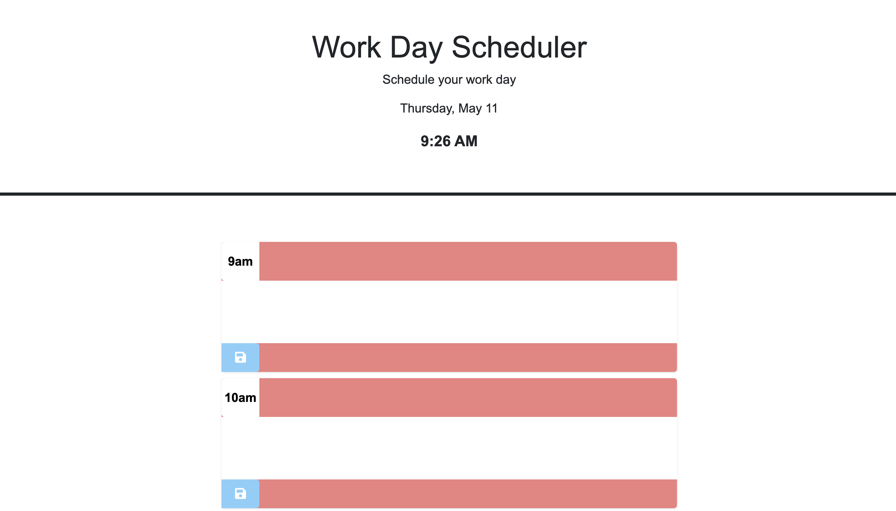

# work-day-scheduler

A simple calender application for scheduling your work day.

## features

- Hourly time blocks 9-5
- save event for a time block
- simple user interface

## Technologies Used

- Html
- CSS
- Javascript
- Day.js
- Bootstrap

## Usage

- Current day and time are displayed at the top
- Each time black represents an hour of work day
- click on white text area to enter or edit a event
- events are stored locally and will stay if page is reloaded.

## Getting Started

- Click on website link to use
  
